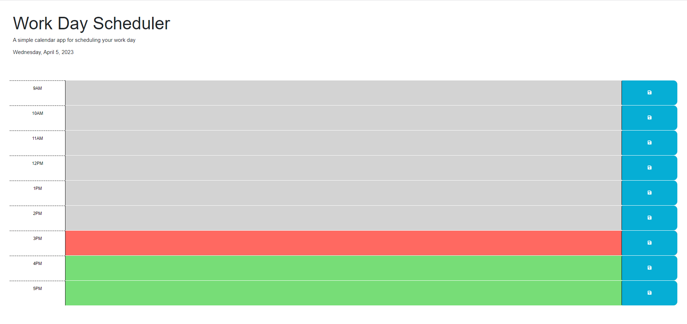

# Module 5 Challenge
This is a Work Day Schedule that will save user input in time slot boxes as well as update the color of the time blocks depending on if it is before, during, or after the current hour. The current date is also displayed at the top of the page.

## Installation

- N/A
- [Link to Website](https://joeyrodo.github.io/Module-5-Challenge/)

## Usage

- Click on a time box to enter a description or goal for that hour
- Click the blue "save" button to save the text to that box for the future.